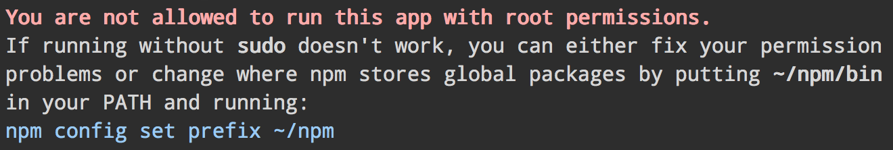

# sudo-block [](http://travis-ci.org/sindresorhus/sudo-block)

> Block users from running your app with root permissions.




## Install

Install with [npm](https://npmjs.org): `npm install --save sudo-block`


## Example

```js
var sudoBlock = require('sudo-block');
sudoBlock();
```


## API

### sudoBlock(*message*)

When a file containing this function is run with root permissions it will exit and show an error message telling the user how to fix the problem so they don't have to run it with `sudo`. Accepts a custom `message`.


### sudoBlock.isRoot

Boolean indicating whether the current user is `root`.


## License

MIT © [Sindre Sorhus](http://sindresorhus.com)
